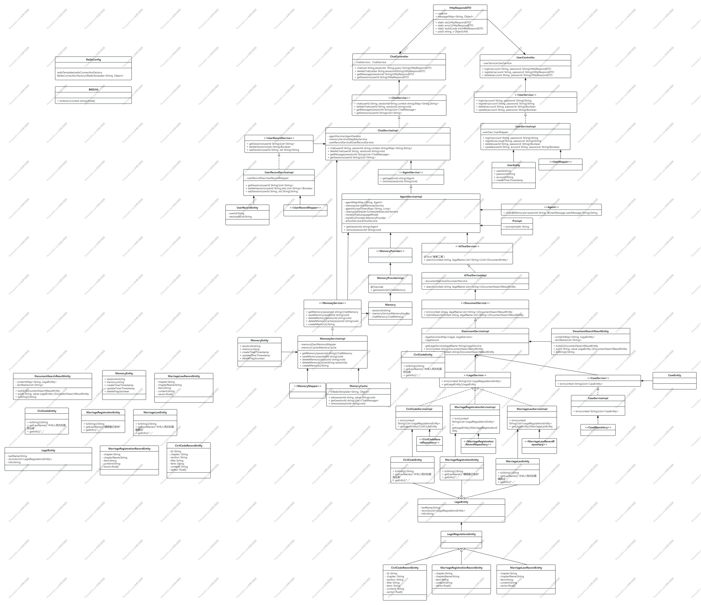

# MQLS Dev 0.0.4

## 更新内容

| 版本 | 更新内容     | 更新时间 |
| ----- | ------------------ | -------- |
| 0.0.1 | 初始化系统框架     | 2025-11-04 |
| 0.0.2 | 完成记忆持久化部分 | 2025-11-05 |
| 0.0.3 | 完成代理部分、构建ES部分的框架 | 2025-11-05 |
| 0.0.4 | 完善了代理与缓存部分的问题 | 2025-11-7 |
|  |  |  |
|  |  |  |
|  |  |  |
|  |  |  |
|  |  |  |

## UML类图

https://www.processon.com/v/6909b12d9586bb564a4990ab

