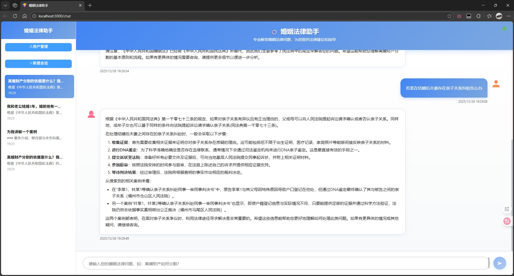
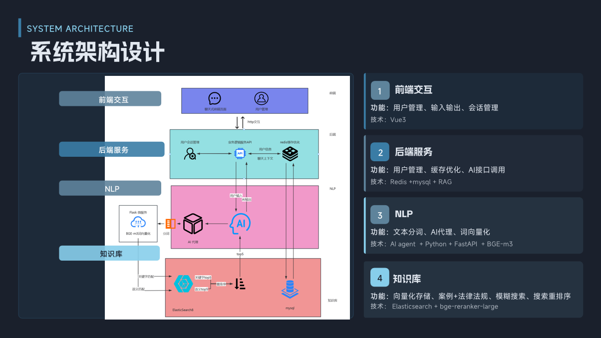
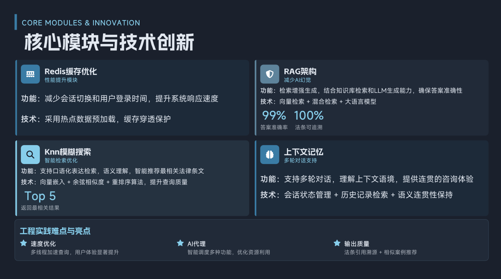

# 婚姻法问答系统

传统法律咨询服务长期面临着**响应时效滞后**与**信息检索低效**的双重困境。用户在面临紧急法律问题时，往往需要经历漫长的排队等待；而律师在处理案件时，也需在海量法规、判例、司法解释中耗费大量时间进行人工检索。这种低效的服务模式不仅增加了用户的时间成本，也制约了法律服务行业的数字化转型升级。针对这一行业共性难题，本项目研发了基于**Qwen-max大模型**与**RAG检索增强生成架构**深度融合的智能法律问答系统，旨在构建一个兼具专业深度与响应速度的新一代法律智能服务平台。

## 核心技术架构

#### 基座模型：Qwen-max大语言模型

系统以阿里云通义千问系列的**Qwen-max**作为核心认知引擎。该模型具备以下优势：

- **强大的中文理解能力**：针对中文法律文本的复杂表述、专业术语及逻辑结构进行深度优化
- **长文本处理能力**：支持超长上下文窗口，可一次性解析完整的合同文本、判决书或法律意见书
- **知识边界可控**：通过RAG架构有效约束生成范围，避免大模型常见的"幻觉"问题，确保法律建议的严谨性

#### Agent智能体：LangChain4j提供AgentService实现智能体构建

由Agent智能体自动实现各组件管理，包括上下文管理、工具调用等。该实现方式具有如下优势：

- **低代码实现**：通过直接使用LangChain4j提供的ChatMessage等类轻松实现上下文管理

- **组件装配容易**：通过Agent构建器的.tools()方法或@Tool等高级方法能快速且容易的声明工具并交由Agent调用

#### 混合检索：Elasticsearch向量检索与关键字检索

由Elasticsearch数据库提供的Knn向量检索与关键字检索结合Reranker重排列模型实现高效、准确的检索。优势在于：

- **易于实现**：Elasticsearch原生支持Knn向量检索与关键字检索
- **高效与准确并存**：混合检索查全率与查准率可达90%+

# MQLS Dev 0.1.23

Release 0.0.13 发行版 2025-12-25

Release 0.1.20 发行版 2025-12-26

## 更新内容

| 版本    | 更新内容                      | 更新时间       |
|-------|---------------------------|------------|
| 0.0.1 | 初始化系统框架                   | 2025-11-04 |
| 0.0.2 | 完成记忆持久化部分                 | 2025-11-05 |
| 0.0.3 | 完成代理部分、构建ES部分的框架          | 2025-11-05 |
| 0.0.4 | 完善了代理与缓存部分的问题             | 2025-11-07 |
| 0.0.5 | 添加了基础的用户模块、添加了会话模块        | 2025-11-10 |
| 0.0.5 | 完善了用户模块与会话模块的逻辑           | 2025-11-10 |
| 0.0.6 | 完善了接口交互逻辑                 | 2025-11-11 |
| 0.0.7 | 构建基本的知识库框架，优化了缓存在进程关闭时的行为 | 2025-11-11 |
| 0.0.8 | 完善了注册和登录的mapper           | 2025-11-11 |
| 0.0.9 | 完善了知识库框架的逻辑 | 2025-11-12 |
| 0.0.10 | 构建案例库框架，引入婚姻法到知识库 | 2025-11-20 |
| 0.0.11 | 引入了bge-reranker-large重排模型完善处理逻辑 | 2025-11-21 |
| 0.0.12 | 完善了检索逻辑，修复了LegalService在DocumentServiceImpl中的逻辑问题 | 2025-11-21 |
| 0.0.13 | Release 0.0.13 | 2025-12-25 |
| 0.0.17 | 引入线程池机制优化查询执行速度 | 2025-12-25 |
| 0.0.19 | 引入了案件库 | 2025-12-26 |
| 0.1.20 | Release 0.1.20 | 2025-12-26 |

注：测试时先在用户表中添加一个用户

## 安装重排模型步骤：

1. 创建虚拟环境 

   python -m xinference_env .

2. 激活虚拟环境
   .\xinference_env\Scripts\activate

3. 安装xinference
   pip install "xinference[all]"

4. 安装flask
   pip install flask

5. 启动xinference：IP本地9997端口（注意：若更改则同时更改yml内的rerank.url、rerank_main.py中的url以确保一致）
   xinference-local --host 127.0.0.1 --port 9997

6. 启动bge-reranker-large模型
   xinference launch --model-name bge-reranker-large --model-type rerank --replica 1

7. 等模型下完之后启动服务（src/main/resources/python/rerank_main.py）注意在虚拟环境内启动以免其他问题

8. 运行ExtraServiceTest中的rerank_test()即可测试是否成功

## UML类图

https://www.processon.com/v/658ec3978038833b3e0e648c
